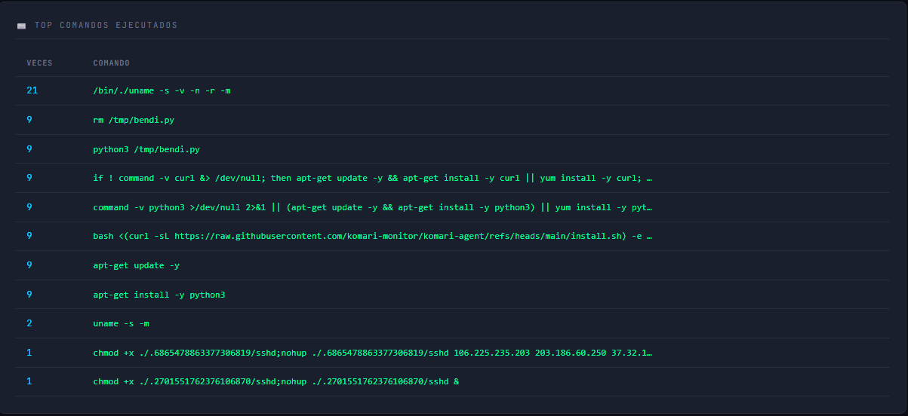
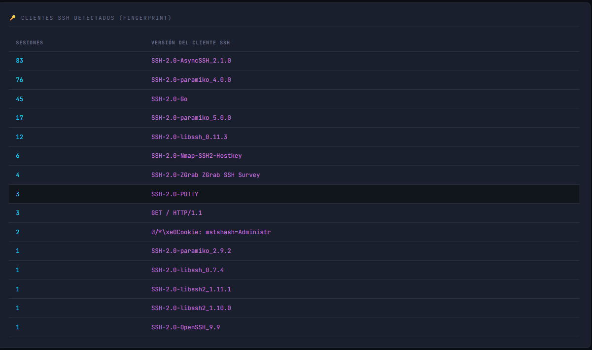
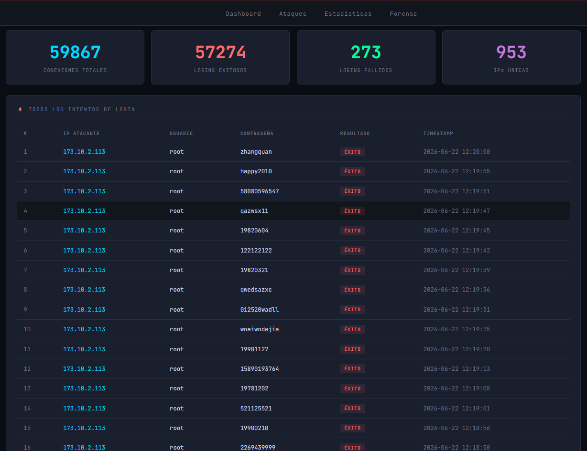

# 🛡️ Cowrie Threat Dashboard

> Honeypot SSH desplegado en internet + dashboard de análisis de amenazas en tiempo real.
> Proyecto de portafolio Blue Team / SOC: captura, procesa y visualiza ataques reales.


---

## 📖 Descripción

Sistema completo de detección y análisis de amenazas construido alrededor de un
**honeypot SSH (Cowrie)** expuesto a internet en un servidor cloud. El honeypot
captura los ataques automatizados que recorren la red constantemente, y un
**dashboard Django** procesa esos logs para visualizarlos como una consola SOC:
estadísticas en tiempo real, geolocalización de atacantes, credenciales más usadas
y un módulo forense que muestra los comandos y el malware que los atacantes
intentan ejecutar.

En **2 semanas** de exposición capturó más de **25.000 sesiones de ataque** y
**220 descargas de malware**, incluyendo campañas de cryptojacking, propagación
de botnet y backdoors SSH.

📄 **[Informe de análisis →](docs/INFORME_ANALISIS.md)** · 🦠 **[Anexo de análisis de malware →](docs/ANEXO_ANALISIS_MALWARE.md)**

---

## ✨ Características

- **Captura 24/7** de ataques SSH reales mediante honeypot Cowrie.
- **Pipeline automatizado**: importación de logs cada 5 minutos vía cron.
- **Dashboard en tiempo real** con auto-refresh (30s).
- **Geolocalización** de IPs atacantes en mapa mundial interactivo.
- **Análisis forense**: comandos ejecutados, archivos descargados (IOCs) y
  fingerprints de los clientes SSH.
- **Triaje de malware** con VirusTotal y correlación MITRE ATT&CK.

---

## 📊 Hallazgos destacados (2 semanas)

- **25.010 sesiones** de ataque · **23.659 comandos** ejecutados · **220 descargas**.
- **64%** de los intentos dirigidos al usuario `root`.
- Las contraseñas más usadas son **credenciales hardcodeadas de malware**
  (`LeitboGi0ro`, `123@@@`, `smo@@kkklss`), no diccionarios humanos → tráfico de bots.
- **5 muestras de malware analizadas**: RedTail (criptominero ARM), lanzador xmrig,
  módulo de propagación de botnet, backdoor SSH (abuso de PAM) y discord-exploit
  (usa Discord como C2).
- **Hallazgo clave**: la muestra más frecuente (124 descargas) es detectada por solo
  **3 de 75 antivirus** — demuestra el valor de la detección por comportamiento.

---

## 🏗️ Arquitectura

```
Atacantes (internet)
    │  puerto 22
    ▼
[ Servidor cloud — Ubuntu 24.04 ]
    │  iptables redirige 22 → 2223
    ▼
[ Cowrie 3.0.1 ]  honeypot SSH (servicio systemd, 24/7)
    │  log JSON
    ▼
[ cron 5 min ]  →  import_cowrie  →  SQLite
    │
    ▼
[ Dashboard Django ]  estadísticas · mapa · forense
```

---

## 🖼️ Capturas

### Dashboard principal


### Estadísticas


### Análisis forense




### Tabla de ataques


---

## 🛠️ Stack técnico

| Componente | Tecnología |
|------------|------------|
| Honeypot | Cowrie 3.0.1 (SSH/Telnet, media interacción) |
| Backend | Python 3.12 · Django 6.0 · SQLite |
| Visualización | Chart.js · Leaflet.js (mapa) |
| Geolocalización | ip-api.com (cacheada) |
| Threat intel | VirusTotal · Joe Sandbox |
| Infraestructura | VPS cloud · Ubuntu 24.04 · systemd · cron |
| Seguridad | SSH en puerto no estándar · doble firewall (perimetral + iptables) |

---

## 🚀 Instalación (dashboard)

> El dashboard es la parte reproducible. El honeypot Cowrie se instala aparte
> siguiendo [la documentación oficial de Cowrie](https://github.com/cowrie/cowrie).

```bash
# Clonar
git clone https://github.com/hanssoto-cyber/cowrie-dashboard.git
cd cowrie-dashboard

# Entorno virtual
python3 -m venv venv
source venv/bin/activate        # Windows: venv\Scripts\activate

# Dependencias
pip install -r requirements.txt

# Variables de entorno (crear .env dentro de cowrie_dashboard/)
cd cowrie_dashboard
cat > .env <<'EOF'
SECRET_KEY=tu-secret-key
DEBUG=True
ALLOWED_HOSTS=127.0.0.1,localhost
COWRIE_LOG_PATH=/ruta/a/cowrie/var/log/cowrie/cowrie.json
EOF

# Base de datos
python manage.py migrate

# Importar logs del honeypot
python manage.py import_cowrie

# Servidor
python manage.py runserver
```

Para datos de demostración sin un honeypot real:
```bash
python manage.py seed_demo --count 200
```

---

## 🔌 Guía de acceso al dashboard (con honeypot remoto)

Cuando el honeypot corre en un servidor remoto, el dashboard NO se expone a
internet: se accede mediante un **túnel SSH**. Se necesitan dos cosas activas a la
vez — el servidor Django corriendo en la VM y el túnel SSH abierto.

### Paso 1 — Levantar el servidor (en la VM)
Conéctate a la VM y arranca el servidor:
```bash
ssh -i <llave> -p <puerto_admin> usuario@IP
cd ~/cowrie-dashboard
source venv/bin/activate
cd cowrie_dashboard
python manage.py runserver 127.0.0.1:8000
```
Deja esa terminal abierta con el servidor corriendo.

### Paso 2 — Abrir el túnel SSH
Hay **dos formas** de hacerlo:

**Forma A — Comando directo** (en otra terminal, desde tu equipo):
```bash
ssh -i <llave> -p <puerto_admin> -L 8000:127.0.0.1:8000 usuario@IP
```
El parámetro `-L 8000:127.0.0.1:8000` reenvía el puerto 8000 local al 8000 de la VM.
Recomendado añadir keepalive para que no se caiga por inactividad:
```bash
ssh -i <llave> -p <puerto_admin> -o ServerAliveInterval=60 -L 8000:127.0.0.1:8000 usuario@IP
```

**Forma B — Con alias en `~/.ssh/config`** (más cómodo):
Crea/edita `~/.ssh/config` y añade:
```
Host honeypot
    HostName <IP>
    User <usuario>
    Port <puerto_admin>
    IdentityFile <ruta/a/la/llave>
    ServerAliveInterval 60
    ServerAliveCountMax 3
```
Luego el túnel se abre con un comando corto:
```bash
ssh -L 8000:127.0.0.1:8000 honeypot
```

### Paso 3 — Abrir en el navegador
```
http://localhost:8000
```

### Solución de problemas
| Error | Causa | Solución |
|-------|-------|----------|
| `Permission denied (publickey)` / `bad permissions` | Permisos de la llave | `chmod 600 <llave>` (en Git Bash) |
| `That port is already in use` | El servidor ya corría | Abrir el navegador, o `pkill -f runserver` y reintentar |
| La página no carga | Falta el túnel o el servidor | Verificar que ambas terminales estén activas |
| `Connection timed out` | La IP del servidor cambió | Verificar la IP en el panel del proveedor cloud |

> Nota: el honeypot sigue capturando ataques (systemd + cron) aunque el dashboard
> esté cerrado. El servidor del dashboard solo se levanta para *ver* los datos.

---

## ⚙️ Comandos disponibles

| Comando | Descripción |
|---------|-------------|
| `import_cowrie` | Importa el log JSON de Cowrie a la base de datos |
| `import_cowrie --path <ruta>` | Importa desde una ruta específica |
| `seed_demo --count N` | Genera N ataques de prueba para demo |

---

## ⚠️ Aviso

Proyecto con fines **educativos y de portafolio**. El honeypot se operó en un
entorno aislado y desechable. Las muestras de malware capturadas se mantuvieron
en cuarentena sin ejecución. Los IOCs publicados son para uso defensivo.

No incluye datos sensibles de infraestructura (IP del servidor, llaves, puertos
de administración).

---

## 👤 Autor

**Hans Soto** — Ingeniería en Ciberseguridad · Blue Team / SOC
[GitHub](https://github.com/hanssoto-cyber) · [LinkedIn](https://www.linkedin.com/in/hans-soto-gonzalez-a142b8170/) · [Portafolio](https://hsoto.pythonanywhere.com)
