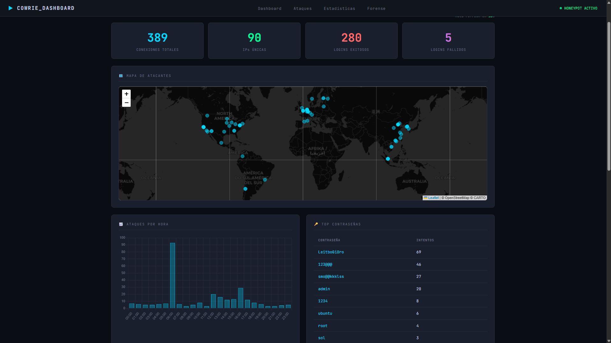
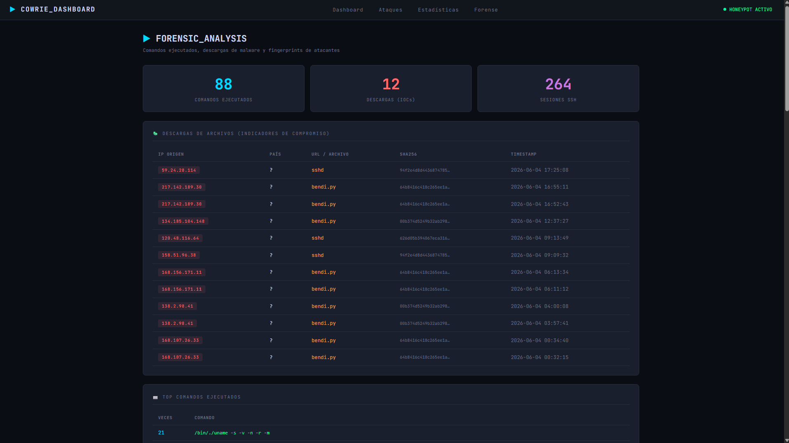
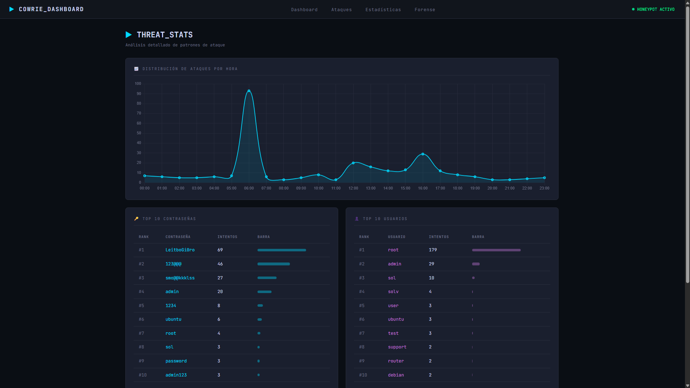

# 🛡️ Cowrie Threat Dashboard

> Honeypot SSH desplegado en internet + dashboard de análisis de amenazas en tiempo real.
> Proyecto de portafolio Blue Team / SOC: captura, procesa y visualiza ataques reales.


---

## 📖 Descripción

Sistema completo de detección y análisis de amenazas construido alrededor de un
**honeypot SSH (Cowrie)** expuesto a internet en un servidor cloud. El honeypot
captura los ataques automatizados que recorren la red constantemente, y un
**dashboard Django** procesa esos logs para visualizarlos como una consola SOC:
estadísticas en tiempo real, geolocalización de atacantes, credenciales más usadas
y un módulo forense que muestra los comandos y el malware que los atacantes
intentan ejecutar.

En ~24 horas de exposición capturó **359 conexiones** de **84 IPs únicas** en 9+
países, incluyendo dos campañas de malware completas (un módulo de propagación de
botnet y un backdoor SSH).

📄 **[Ver informe completo de análisis →](docs/INFORME_ANALISIS.md)**

---

## ✨ Características

- **Captura 24/7** de ataques SSH reales mediante honeypot Cowrie.
- **Pipeline automatizado**: importación de logs cada 5 minutos vía cron.
- **Dashboard en tiempo real** con auto-refresh (30s).
- **Geolocalización** de IPs atacantes en mapa mundial interactivo.
- **Análisis forense**: comandos ejecutados, archivos descargados (IOCs) y
  fingerprints de los clientes SSH.
- **Correlación MITRE ATT&CK** de las técnicas observadas.

---

## 🏗️ Arquitectura

```
Atacantes (internet)
    │  puerto 22
    ▼
[ Servidor cloud — Ubuntu 24.04 ]
    │  redirección a puerto interno
    ▼
[ Cowrie 3.0.1 ]  honeypot SSH (servicio systemd, 24/7)
    │  log JSON
    ▼
[ cron 5 min ]  →  import_cowrie  →  SQLite
    │
    ▼
[ Dashboard Django ]  estadísticas · mapa · forense
```

---

## 🖼️ Capturas

> Agregar las capturas reales en `docs/screenshots/` y enlazarlas aquí.

| Vista | Descripción |
|-------|-------------|
| `dashboard.png` | Panel principal: stats, mapa de atacantes, gráficos |
| `stats.png` | Top credenciales y usuarios, ataques por hora |
| `forensic.png` | Comandos ejecutados, descargas (IOCs), fingerprints |

```markdown
## 🖼️ Capturas

### Dashboard principal


### Análisis forense


### Estadísticas

```

---

## 🛠️ Stack técnico

| Componente | Tecnología |
|------------|------------|
| Honeypot | Cowrie 3.0.1 (SSH/Telnet, media interacción) |
| Backend | Python 3.12 · Django 6.0 · SQLite |
| Visualización | Chart.js · Leaflet.js (mapa) |
| Geolocalización | ip-api.com (cacheada) |
| Infraestructura | VPS cloud · Ubuntu 24.04 · systemd · cron |
| Seguridad | SSH en puerto no estándar · doble firewall (perimetral + iptables) |

---

## 📊 Hallazgos destacados

- **64% de los ataques** apuntaron al usuario `root` (búsqueda de privilegio máximo).
- Las 3 contraseñas más usadas son **credenciales hardcodeadas de malware**
  (`LeitboGi0ro`, `123@@@`, `smo@@kkklss`), no diccionarios humanos → tráfico de bots.
- Se capturó un **módulo de propagación de botnet** (escáner SSH en Python que
  instala un servicio systemd oculto) y un **backdoor ELF** que abusa de PAM.
- **14 técnicas MITRE ATT&CK** identificadas (ver informe).

---

## 🚀 Instalación (dashboard)

> El dashboard es la parte reproducible. El honeypot Cowrie se instala aparte
> siguiendo [la documentación oficial de Cowrie](https://github.com/cowrie/cowrie).

```bash
# Clonar
git clone https://github.com/hanssoto-cyber/cowrie-dashboard.git
cd cowrie-dashboard

# Entorno virtual
python3 -m venv venv
source venv/bin/activate        # Windows: venv\Scripts\activate

# Dependencias
pip install -r requirements.txt

# Variables de entorno (crear .env dentro de cowrie_dashboard/)
cd cowrie_dashboard
cat > .env <<'EOF'
SECRET_KEY=tu-secret-key
DEBUG=True
ALLOWED_HOSTS=127.0.0.1,localhost
COWRIE_LOG_PATH=/ruta/a/cowrie/var/log/cowrie/cowrie.json
EOF

# Base de datos
python manage.py migrate

# Importar logs del honeypot
python manage.py import_cowrie

# Servidor
python manage.py runserver
```

Para datos de demostración sin un honeypot real:
```bash
python manage.py seed_demo --count 200
```

---

## ⚙️ Comandos disponibles

| Comando | Descripción |
|---------|-------------|
| `import_cowrie` | Importa el log JSON de Cowrie a la base de datos |
| `import_cowrie --path <ruta>` | Importa desde una ruta específica |
| `seed_demo --count N` | Genera N ataques de prueba para demo |

---

## 📁 Estructura del proyecto

Ver [estructura detallada más abajo](#estructura-del-repositorio).

---

## ⚠️ Aviso

Proyecto con fines **educativos y de portafolio**. El honeypot se operó en un
entorno aislado y desechable. Las muestras de malware capturadas se mantuvieron
en cuarentena sin ejecución. Los IOCs publicados son para uso defensivo.

No incluye datos sensibles de infraestructura (IP del servidor, llaves, puertos
de administración).

---

## 👤 Autor

**Hans Soto** — Ingeniería en Ciberseguridad · Blue Team / SOC
[GitHub](https://github.com/hanssoto-cyber) · [LinkedIn](https://www.linkedin.com/in/hans-soto-gonzalez-a142b8170/) · [Portafolio](https://hsoto.pythonanywhere.com)
